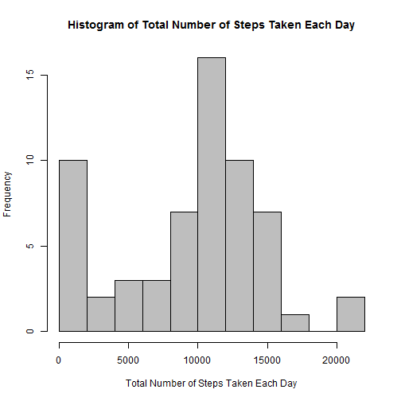
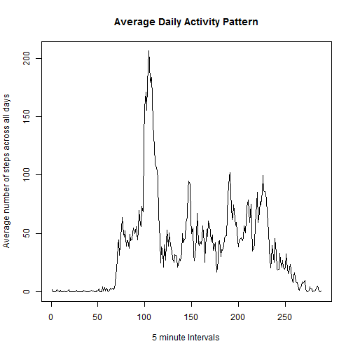
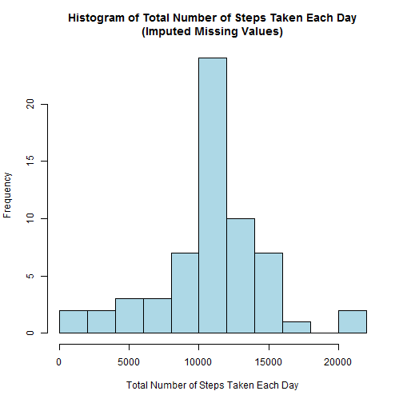
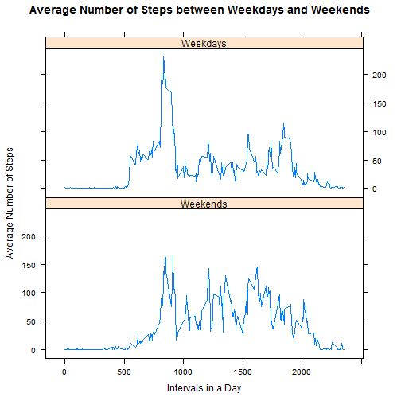

# Reproducible Research: Peer Assessment 1

## Session info

```r
sessionInfo()
```

```
## R version 3.1.0 (2014-04-10)
## Platform: i386-w64-mingw32/i386 (32-bit)
## 
## locale:
## [1] LC_COLLATE=English_United States.1252 
## [2] LC_CTYPE=English_United States.1252   
## [3] LC_MONETARY=English_United States.1252
## [4] LC_NUMERIC=C                          
## [5] LC_TIME=English_United States.1252    
## 
## attached base packages:
## [1] stats     graphics  grDevices utils     datasets  methods   base     
## 
## other attached packages:
## [1] knitr_1.6
## 
## loaded via a namespace (and not attached):
## [1] evaluate_0.5.5 formatR_0.10   stringr_0.6.2  tools_3.1.0
```
Information about the current R session


## Loading and preprocessing the data
- Forked [RepData_PeerAssessment1] Repository from github  
(SHA-1 commit ID dc20c7c4e92aea6af318a611e2669d5b9c6cbfaf)
- Set working directory to RepData_PeerAssessment1 folder  
- Read in data from activity.zip

```r
zipfilecontent <- unzip("activity.zip",list=TRUE)
pam <- read.csv(unz("activity.zip", as.character(zipfilecontent$Name)))
```

### Get summary and structure of data

```r
summary(pam)
```

```
##      steps               date          interval   
##  Min.   :  0.0   2012-10-01:  288   Min.   :   0  
##  1st Qu.:  0.0   2012-10-02:  288   1st Qu.: 589  
##  Median :  0.0   2012-10-03:  288   Median :1178  
##  Mean   : 37.4   2012-10-04:  288   Mean   :1178  
##  3rd Qu.: 12.0   2012-10-05:  288   3rd Qu.:1766  
##  Max.   :806.0   2012-10-06:  288   Max.   :2355  
##  NA's   :2304    (Other)   :15840
```

```r
str(pam)
```

```
## 'data.frame':	17568 obs. of  3 variables:
##  $ steps   : int  NA NA NA NA NA NA NA NA NA NA ...
##  $ date    : Factor w/ 61 levels "2012-10-01","2012-10-02",..: 1 1 1 1 1 1 1 1 1 1 ...
##  $ interval: int  0 5 10 15 20 25 30 35 40 45 ...
```

## What is mean total number of steps taken per day?
### Make a histogram of the total number of steps taken each day

```r
## tapply function calculates the sum of steps for each date
test1 <- tapply(pam$steps, pam$date, sum, na.rm=TRUE)
#test1

## Set to 10 bins, breaks=10, for better visual distribution of data
hist(test1, breaks=10, col="gray",
     xlab="Total Number of Steps Taken Each Day",
     ylab="Frequency",
     main="Histogram of Total Number of Steps Taken Each Day")
```

 

### Calculate and report the mean and median total number of steps taken per day


```r
## Calculate the mean total number of steps taken per day
mean(test1)
```

```
## [1] 9354
```

```r
## Calculate the median total number of steps taken per day
median(test1)
```

```
## [1] 10395
```

## What is the average daily activity pattern?

### Make a time series plot of the 5-minute interval (x-axis) and the average number of steps taken, averaged across all days (y-axis)

```r
## tapply function calculates the mean number of steps for a given interval
## The intervals are labeled every 5 minutes on the hour
## 5 10 15 ...50 55 100 105
## Note the gap from 55 to 100 (100 effectively means 1 hour 00 minutes)
## There are 24 hr x 60 min = 1440 min in a day
## 1440 min / 5 min = 288 5-min intervals per day
test2 <- tapply(pam$steps, pam$interval, mean, na.rm=TRUE) 

plot(test2, type="l", xlab= "5 minute Intervals",
     ylab="Average number of steps across all days",
     main="Average Daily Activity Pattern")
```

 

### Which 5-minute interval, on average across all the days in the dataset, contains the maximum number of steps?

```r
max(test2)
```

```
## [1] 206.2
```

```r
which.max(test2)
```

```
## 835 
## 104
```
Interval **104**, labeled as **835**, contains on average the maximum number of steps in a day **206.1698**

## Imputing missing values

Total number of missing values and strategy for filling in missing values in dataset are noted below


```r
## The number of missing values in steps column
## The number of NAs is also present in the summary data listed above
sum(is.na(pam$steps))
```

```
## [1] 2304
```

```r
## A new column "stepsImpute" is generated with apply function
## The apply function takes:
## Argument 1: dataframe
## Argument 2: 1 -> apply function by row; 2 -> apply function by column
## Argument 3: function(x)
## If x[1]=steps is NA, insert with mean of the corresponding interval x[2]
## else insert with current x[1] value
pam$stepsImpute <- apply(pam[,c("steps","interval")],1,function(x) 
{pam$stepsImpute = ifelse(is.na(x[1]), mean(pam[which(pam$interval==x[2]),1],
                                            na.rm=TRUE), x[1])})

# remove original steps column that contained missing data NAs
pamImpute <- pam[,-1]

# move stepsImpute to first column
pamImpute <- pamImpute[,c(3,1,2)]

head(pamImpute)
```

```
##   stepsImpute       date interval
## 1     1.71698 2012-10-01        0
## 2     0.33962 2012-10-01        5
## 3     0.13208 2012-10-01       10
## 4     0.15094 2012-10-01       15
## 5     0.07547 2012-10-01       20
## 6     2.09434 2012-10-01       25
```
The **stepsImpute** column contains imputed data for missing steps values


```r
## tapply function calculates the sum of steps for each date for pamImpute data
test3 <- tapply(pamImpute$stepsImpute, pamImpute$date, sum, na.rm=TRUE)

## Set to 10 bins, breaks=10, for better visual distribution of data
hist(test3, breaks=10, col="light blue",
     xlab="Total Number of Steps Taken Each Day",
     ylab="Frequency",
     main="Histogram of Total Number of Steps Taken Each Day\n(Imputed Missing Values)")
```

 

```r
## Calculate the mean and median total number of steps taken per day
## (Imputed missing values with mean of the corresponding interval)
mean(test3)
```

```
## [1] 10766
```

```r
median(test3)
```

```
## [1] 10766
```

**The impact of imputing missing data on the estimates of the total daily number of steps:**
- Based on comparing histograms between the original data and imputed data, the frequency distribution of total daily number of steps has changed. In the original histogram, there is a high frequency bar in the low range of steps. In the new histogram where missing values have been imputed, the frequency in the low range decreases substantially, and the frequency near the mean total number of steps increases. 

- The mean increases substantially from the original data compared to the imputed data

- The mean and median values are much closer in the imputed dataset compared to the original dataset.


## Are there differences in activity patterns between weekdays and weekends?


```r
## Turn date column to POSIXlt format
pamImpute$dateformat <- strptime(pamImpute$date, format="%Y-%m-%d")
pamImpute$day <- weekdays(pamImpute$dateformat)

#pamImpute$weekwhich <- apply(pamImpute[,c("day")],1,function(X)
#  {pamImpute$weekwhich = ifelse(x %in% c('Saturday','Sunday'), "weekend", #"weekday")})

## Add column that categorizes weekend or weekday based on which day of week
pamImpute <- transform(pamImpute, weekwhich = ifelse(pamImpute$day %in% c("Saturday","Sunday"), "weekend","weekday"))

str(pamImpute)
```

```
## 'data.frame':	17568 obs. of  6 variables:
##  $ stepsImpute: num  1.717 0.3396 0.1321 0.1509 0.0755 ...
##  $ date       : Factor w/ 61 levels "2012-10-01","2012-10-02",..: 1 1 1 1 1 1 1 1 1 1 ...
##  $ interval   : int  0 5 10 15 20 25 30 35 40 45 ...
##  $ dateformat : POSIXlt, format: "2012-10-01" "2012-10-01" ...
##  $ day        : chr  "Monday" "Monday" "Monday" "Monday" ...
##  $ weekwhich  : Factor w/ 2 levels "weekday","weekend": 1 1 1 1 1 1 1 1 1 1 ...
```
The **day** column notes which day of the week  
The **weekwhich** column categorizes into two factors - weekday or weekend


```r
library(plyr)

## Use awesome plyr package
## For the pamImpute data, group by "interval" and "weekwhich" 
## and get mean of steps
pamweek <- ddply(pamImpute,c("interval","weekwhich"),
                 function(pamImpute)mean(pamImpute$stepsImpute))

## Show first six rows of pamweek data
head(pamweek)
```

```
##   interval weekwhich      V1
## 1        0   weekday 2.25115
## 2        0   weekend 0.21462
## 3        5   weekday 0.44528
## 4        5   weekend 0.04245
## 5       10   weekday 0.17317
## 6       10   weekend 0.01651
```

```r
## Used lattice package, xyplot, type="l"
## x axis -> interval
## y axis -> average number of steps
## factor -> weekday or weekend
library(lattice)
weekfactor <- factor(pamweek$weekwhich, levels=c("weekend","weekday"),
                     labels=c("Weekends","Weekdays"))

xyplot(pamweek$V1~pamweek$interval|weekfactor, type="l",
       xlab="Intervals in a Day", ylab="Average Number of Steps" ,
       main="Average Number of Steps between Weekdays and Weekends",
       layout=c(1,2))
```

 

The plots likely reflect the difference in daily routine for the "working" weekdays and the "non-working" weekends.

- Speculate Sleeping in on weekends  
Peaks in activity start at later intervals on weekends

- Speculate more activities and errands on weekends  
There are more higher activity peaks spread throughout the day on weekends compared to weekdays


[RepData_PeerAssessment1]:https://github.com/rdpeng/RepData_PeerAssessment1
